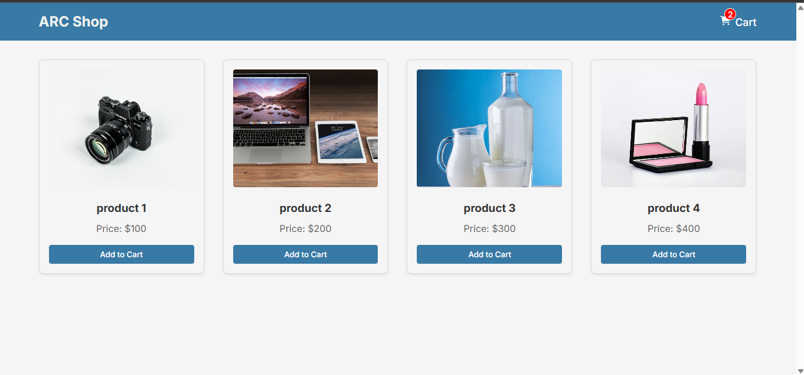
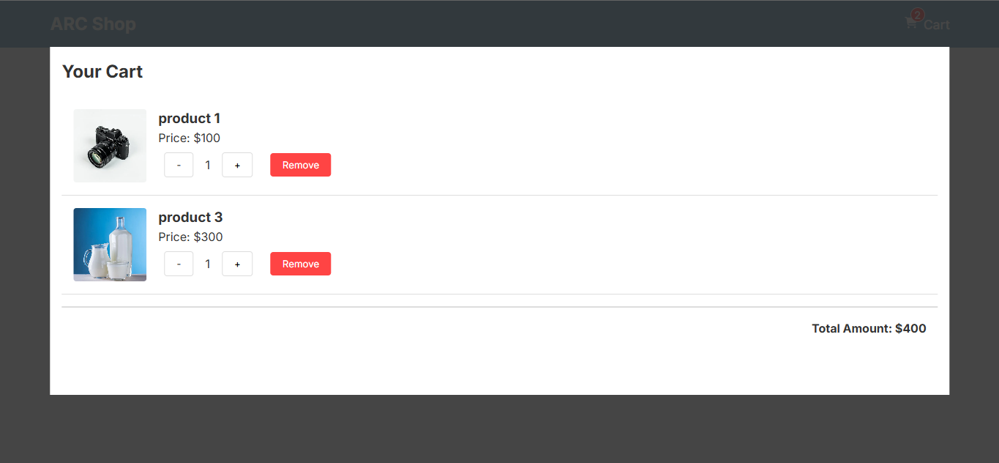

# React Shopping Cart

A modern shopping cart implementation built with React, featuring real-time updates, responsive design, and state management using Context API.

## Features

- 📱 Responsive design that works on desktop and mobile
- 🛍️ Product listing with images and prices
- 🛒 Add/remove items to cart
- ➕ Increase/decrease item quantities
- 💰 Real-time price calculations
- 🔔 Toast notifications for user actions
- 🎨 Clean and modern UI design

## Tech Stack

- React 19
- Vite 6
- React Context API for state management
- React Toastify for notifications
- React Icons for UI elements
- CSS Modules for styling

## Setup and Installation

1. Clone the repository:

```bash
git clone https://github.com/yourusername/Shoping-Cart-React.git
```

2. Navigate to the project directory:

```bash
cd Shoping-Cart-React/shopping-cart
```

3. Install dependencies:

```bash
npm install
```

4. Start the development server:

```bash
npm run dev
```

## Project Structure

```
shopping-cart/
├── src/
│   ├── components/         # React components
│   ├── contexts/          # Context providers
│   ├── data/             # Static data
│   └── App.jsx           # Root component
```

## Key Components

- `CartProvider`: Manages cart state using Context API
- `Products`: Displays product grid
- `Cart`: Shows cart items and total
- `Header`: Navigation with cart counter
- `Modal`: Popup for cart view

## State Management

The app uses React's Context API for state management with the following actions:

- ADD_ITEM: Add new item to cart
- REMOVE_ITEM: Remove item from cart
- INCREASE_QTY: Increment item quantity
- DECREASE_QTY: Decrement item quantity

## Screenshots




## License

MIT License

## 📫 Let's Connect

- GitHub: [SuhelKhanCA](https://github.com/SuhelKhanCA)
- LinkedIn: [Suhel Khan](https://www.linkedin.com/in/suhelkhanska/)
- Twitter: [Suhel Khan](https://twitter.com/@suhelkhanalig)
- Email: suhelkhanca@gmail.com